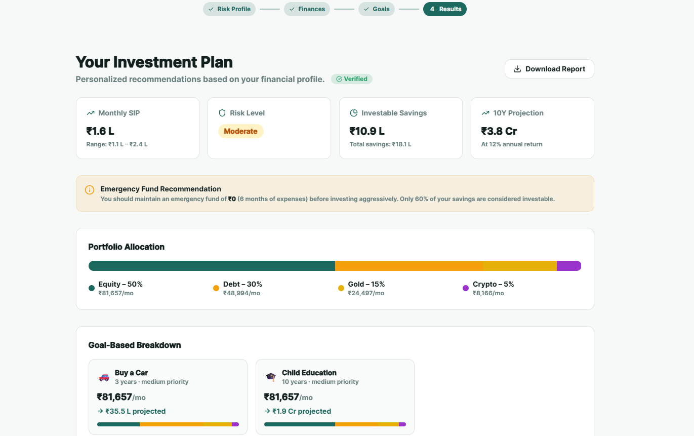
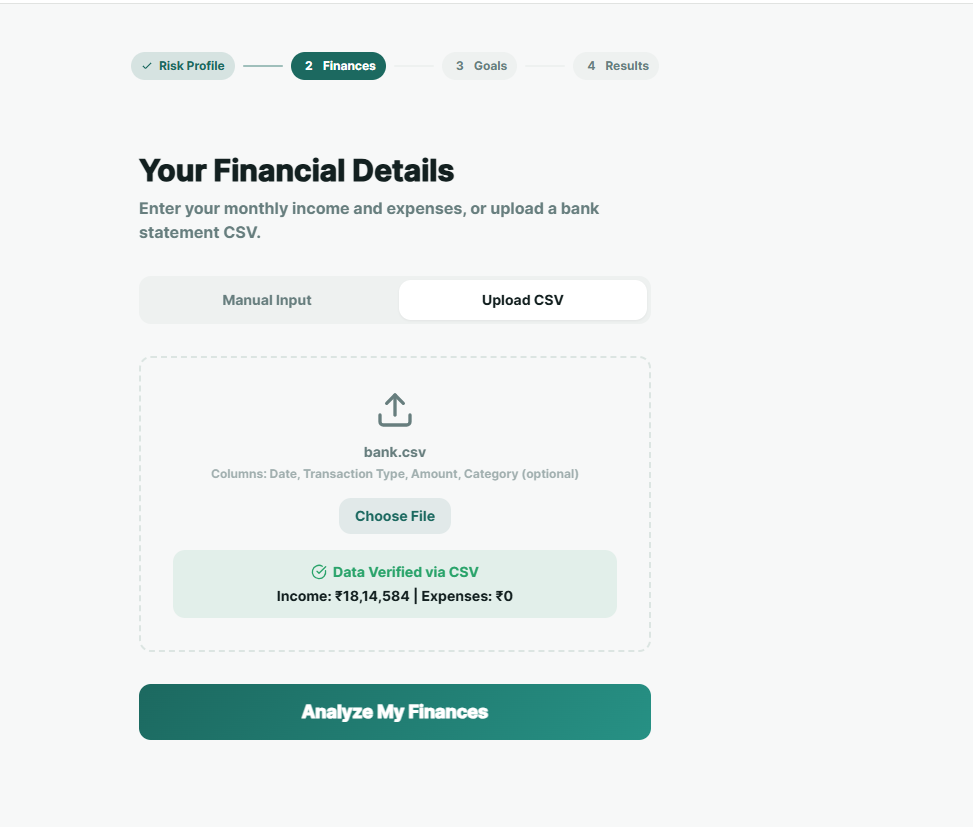
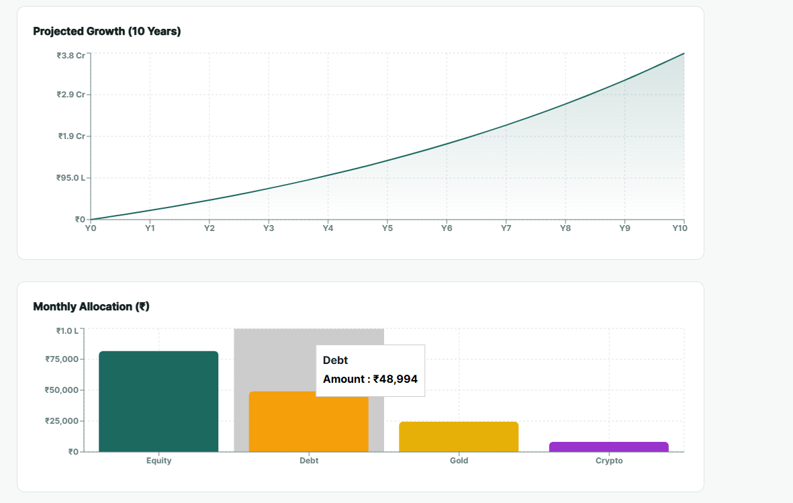

# 💰 SIP Advisor – Smart Investment Planning Tool

**SIP Advisor** is a web-based financial advisory application that helps users analyze and plan their **Systematic Investment Plans (SIP)**.
It provides insights into investment growth, expected returns, and expense tracking to support **better financial decision-making**.

The application focuses on **data-driven investment analysis** with a simple and user-friendly interface.

---

## 📸 Screenshots

### Dashboard



### Investment Analysis



### Graph Visualization



---

## 🚀 Features

* **SIP Calculation**

  * Calculates future value of investments based on monthly contributions and expected return rate.

* **Investment Analysis**

  * Provides insights into total investment, returns, and profit over time.

* **Data Visualization**

  * Displays growth trends using charts and graphs for better understanding.

* **User-Friendly Interface**

  * Simple and intuitive design for easy financial planning.

* **Custom Inputs**

  * Users can modify:

    * Monthly investment amount
    * Duration
    * Expected return rate

---

## ⚙️ Requirements

Ensure the following software is installed:

* Python (v3.x)
* Required libraries (Flask / Pandas / Matplotlib if used)
* Web browser (Chrome, Edge, Firefox)

---

## 🛠️ Technology Stack

### Backend

* Python
* Flask

### Frontend

* HTML
* CSS
* JavaScript
* Typescript

### Data & Visualization

* Pandas
* Matplotlib / Chart.js (based on your implementation)

### Tools

* Git
* GitHub

---

## 🚀 Getting Started

### 1️⃣ Clone the Repository

```bash
git clone https://github.com/Manaswini-2512/sip-advisor.git
cd sip-advisor
```

### 2️⃣ Install Dependencies

```bash
pip install -r requirements.txt
```

### 3️⃣ Run the Application

```bash
python app.py
```

### 4️⃣ Open in Browser

```bash
http://127.0.0.1:5000/
```

---

## 🎯 Use Case

* Helps beginners understand SIP investments
* Assists users in planning long-term financial goals
* Provides visual insights into investment growth

---

## 📌 Future Enhancements

* Add real-time market data integration
* Advanced financial recommendations using AI
* User authentication and portfolio tracking
* Comparison between multiple investment plans

---

## 👩‍💻 Author

**Manaswini Thatipally**

* GitHub: https://github.com/Manaswini-2512


